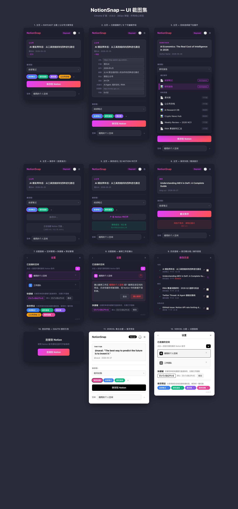

# NotionSnap

**把任何网页，一秒变成整洁的 Notion 笔记。**

Chrome 扩展，一键保存任意网页到 Notion。7 个网站专用解析器 + 30+ 站点智能适配，专为中文内容生态深度优化。Notion Web Clipper 的最佳免费替代品。

当前版本：**v0.6.1** | [变更日志](CHANGELOG.md) | [Chrome Web Store](https://chromewebstore.google.com/detail/notionsnap/eedapefdokhmncpgomaagjipfbafhhgi)

---

## 你遇到过这些问题吗？

- 用 Notion Web Clipper 保存文章，结果只得到空白页？
- 公众号链接复制进 Notion，过几天打开已被删除？
- GitHub README 粘到 Notion 里格式全乱，代码块变成纯文本？
- Twitter 看到好内容只能截屏，事后根本搜不到？

**NotionSnap 解决上述所有问题。** 不是「又一个 Clipper」，而是你真正需要的那一个。

---

## 为什么选 NotionSnap？

| | NotionSnap | Notion Web Clipper | Copy to Notion |
|---|---|---|---|
| 价格 | **免费开源** | 免费 | 付费订阅 |
| 公众号 / 知乎 / 小红书 | **专用解析** | 不支持 | 不支持 |
| Twitter / GitHub | **独立解析器** | 通用提取 | 通用提取 |
| 图片自动上传 | **两阶段：秒存 + 后台替换** | 不稳定 | 支持 |
| 多工作区 | **支持** | 支持 | 不支持 |
| 数据库字段映射 | **9 字段自动匹配** | 不支持 | 支持 |
| 保存去重 | **URL 级别 5 秒去重** | 无 | 无 |
| 中断恢复 | **SW 自动续传** | 无 | 无 |

---

## 支持站点

### 独立解析器（7 个）

专门编写了解析函数，提取精度远超通用工具：

| 网站 | 提取内容 | 特色 |
|------|---------|------|
| **微信公众号** | 标题、作者、正文、图片 | 15 层降级 + 50+ 噪声清理，三种文章格式 |
| **Twitter/X** | 推文文本、作者、时间、图片、视频 | 线程结构保持，推文间分隔线 |
| **GitHub** | README 渲染、Issue 正文+评论 | Markdown → Notion blocks，代码块语言检测 |
| **知乎** | 问题描述 + 前 5 条高赞回答 | 折叠内容自动展开，React 懒加载兼容 |
| **小红书** | 笔记正文、图片轮播、视频 | 评论区噪声过滤 |
| **Medium** | 标题、正文段落、作者、时间 | CTA/推荐/互动按钮噪声清理 |
| **Substack** | 标题、正文、作者、日期 | 付费墙/订阅 CTA 清理，自定义域名适配 |

### 智能适配（30+ 站点）

没有独立解析器的网站，按域名分类匹配最优提取策略：

- **博客平台** — Hashnode、Dev.to、WordPress、简书、博客园
- **新闻媒体** — BBC、CNN、NYT、WSJ、路透社、彭博社、卫报
- **科技媒体** — TechCrunch、36Kr、少数派、The Verge、Ars Technica
- **加密媒体** — CoinDesk、BlockBeats、星球日报、Foresight、The Block
- **通用降级** — 自动识别 article/main/post-content 语义标签，正则纯文本分块兜底

---

## 功能

### 内容提取：不只是「抓全文」

保留原文格式，去除广告噪声，11 种 Notion block 类型完整支持：

段落 · H1/H2/H3 标题 · 引用 · 无序列表 · 有序列表 · 代码块（自动语言检测）· 分隔线 · 图片 · 视频 · 表格 · 富文本内联样式（加粗/斜体/删除线/链接/内联代码/文字颜色）

### 图片永不丢失

网页图片最大的痛点是外链过期。NotionSnap 用两阶段方案彻底解决：

- **Phase 1 — 秒级落库**（< 1 秒）文字内容 + 图片 URL 立即写入，打开 Notion 就能看到完整文章
- **Phase 2 — 后台替换** 扩展在后台下载每张图片，上传到 Notion 服务器托管，外链变永久

### 智能保存，无需手动配置

- **学习你的习惯** — 自动记住每个网站上次保存到哪个页面/数据库，下次自动选中
- **数据库字段自动映射** — 保存到数据库时，自动按名称和类型匹配 URL、作者、发布时间、摘要、网站名称、语言、关键词、封面图、字数，共 9 个元数据字段
- **保存预设** — 不同用途设不同目标（如「阅读笔记」「素材库」），弹窗顶部 5 色 pill 按钮一键切换
- **保存去重** — 同一个 URL 5 秒内重复点击只生效一次

### 三种保存方式

| 方式 | 操作 | 适用场景 |
|------|------|---------|
| Popup 面板 | 点图标 → 预览编辑 → 保存 | 需要选择目标、编辑元数据 |
| 右键菜单 | 页面右键 → 一键保存 | 快速剪藏，不中断阅读 |
| 全局快捷键 | `Ctrl+Shift+S` | 高频用户，肌肉记忆 |

### 稳定到你可以忘记它的存在

- **3 层错误恢复** — 网络波动自动重试（3 次退避），API 限流自动等待，Token 过期自动刷新
- **SW 中断续传** — 浏览器关闭后，后台任务下次启动时自动恢复，不丢数据
- **保存进度透明** — popup 显示分块进度、badge 显示状态、toast 通知保存完成

### 双主题

- **Raycast 暗色主题** — 深色金属质感 + 紫红渐变，护眼且专业
- **Vercel 黑白主题** — Geist 字体 + 1px 边框，极致简洁

---

## 安装

### Chrome Web Store（推荐）

[安装 NotionSnap](https://chromewebstore.google.com/detail/notionsnap/eedapefdokhmncpgomaagjipfbafhhgi)

### 开发者模式

```bash
npx vite build
```

1. Chrome 打开 `chrome://extensions`，开启「开发者模式」
2. 点击「加载已解压的扩展程序」，选择 `dist` 目录

---

## 使用

**1. 连接 Notion** — 点击扩展图标，点击「连接到 Notion」，OAuth 授权即可。支持绑定多个工作区。

**2. 保存第一篇文章** — 打开任意网页 → 点击扩展图标 → 确认标题和内容预览 → 选择目标页面 → 点击「保存到 Notion」。

**3. 快捷方式** — 右键菜单一键保存；快捷键 `Ctrl+Shift+S`（Mac: `MacCtrl+Shift+S`），可在 `chrome://extensions/shortcuts` 自定义。

---

## 隐私与安全

你的数据，你做主：

- **数据直达** — 网页内容直接从浏览器发送到 Notion API，不经过任何第三方服务器
- **OAuth 标准认证** — 不存储你的 Notion 密码
- **Token 本地存储** — 仅在 Chrome 本地存储中，仅用于调用 Notion API
- **100% 开源** — 所有代码在 [GitHub](https://github.com/xifengxx/notion-saver-ext) 公开，随时可审计
- **仅必要权限** — `activeTab`、`storage`、`scripting`、`notifications`、`contextMenus`

---

## 常见问题

**Q: 和 Notion 官方 Web Clipper 有什么区别？**
官方 Clipper 经常保存失败、内容丢失。NotionSnap 专为中文内容优化，7 个独立解析器远超通用提取，且完全免费开源。

**Q: 为什么有些图片在 Notion 里显示不了？**
部分网站的 CDN 开启了防盗链。遇到这种情况图片会显示为占位链接，Phase 2 会自动尝试替换。

**Q: 能保存到 Notion 数据库吗？**
支持。扩展会自动检测目标类型（页面/数据库），保存到数据库时自动匹配 9 个元数据字段。

**Q: 搜索结果里找不到我的页面？**
Notion 公共 API 搜索上限 100 条。但你保存过的页面会被永久记住，不受此限制。

---

## 技术栈

- **Manifest V3** · 纯原生 HTML/CSS/JS，零运行时依赖
- **Notion API** · OAuth 2.0 + REST API v1
- **构建** · Vite + @crxjs/vite-plugin
- **图片上传** · Notion File Upload API（二进制直传 S3）

## 开发

```bash
npm install
npx vite build          # 构建到 dist/
node tests/verify.js    # 运行验证
```

---

## 更新概况

**v0.6.0** — 新增 Twitter/X 独立解析（线程支持）+ GitHub 独立解析（README + Issues）+ Medium/Substack 增强 + 保存去重

**v0.5.3** — 两阶段保存（Phase 1 秒存 + Phase 2 后台替换图片）+ SW 中断续传 + URL 三层匹配

**v0.5.2** — 渐进式加载 + 滚动分页 + 搜索防抖 + 永久保存目标列表

**v0.5.1** — 自动字段匹配（9 元数据字段）+ 页面列表缓存 + 元数据提取增强

**v0.4.0** — 保存预设（pill 按钮）+ 保存历史 + File Upload 图片上传

[完整变更日志 →](CHANGELOG.md)

---

## UI 预览



*12 个 UI 状态一览：Popup 面板双主题、元数据编辑展开、目标选择器、保存进度、设置面板（工作区管理 / 预设管理 / 历史记录）*

---

## License

MIT
